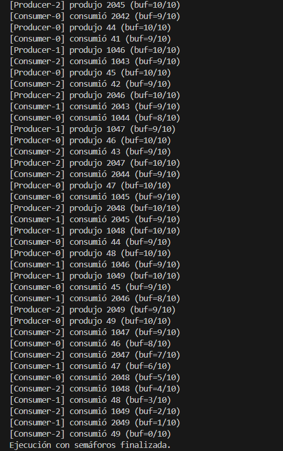

## Introducción: Condición de carrera
Una condición de carrera pasa cuando dos o más hilos intentan usar al mismo tiempo un mismo recurso, ya sea una variable, un archivo o hasta una estructura de datos, y lo raro es que el resultado depende del orden en que esas operaciones se entrelazan, un orden que no está definido de antemano, por eso se vuelve impredecible. El detalle es que lo que pensamos que es “una sola acción” en realidad no lo es, porque a nivel de máquina todo se divide en leer, modificar y luego escribir, entonces si otro hilo se mete justo en medio de ese ciclo, puede quedar todo mal guardado, o como si nada hubiera pasado, como cuando dos hilos suman en un contador y al final queda como si solo uno hubiera sumado.  

Yo pienso que lo complicado es que estos errores no se ven tan fácil, a veces en pruebas normales parece que todo funciona, pero cuando se meten más procesos o se corre en otra computadora con más carga, aparecen los fallos de la nada. Y como el comportamiento no se repite siempre igual, se siente como un error fantasma. Por eso es clave lo de la exclusión mutua, que en pocas palabras significa que un hilo tenga el turno exclusivo en la parte crítica, y los demás se esperen hasta que toque. Lo bueno de esto es que no solo evita que se pierdan datos, también ayuda a pensar mejor en cómo va a comportarse el programa.  

En este trabajo se usan dos formas clásicas de evitar esas broncas: semáforos y monitores en Java, aplicados a un problema bastante usado como ejemplo, el del productor–consumidor con un búfer limitado.

---

## Semáforos y monitores: explicación breve
Los semáforos son como un contador entero que solo puede ser modificado con operaciones atómicas, por ejemplo, `acquire` o `wait` le resta uno, y si está en cero, el hilo se queda esperando hasta que haya chance, mientras que `release` o `signal` le suma uno y despierta a los que estaban bloqueados. Con eso se puede controlar que nadie más entre a la sección crítica, usando un semáforo binario que funciona casi como un candado. Y no solo sirve para exclusión mutua, también para manejar condiciones, como cuando tienes un búfer con espacios vacíos y llenos, ahí se usan tres semáforos típicos: uno para `empty`, otro para `full` y otro `mutex` que protege la entrada al búfer. Yo pienso que la ventaja es que son rápidos y directos, pero lo malo es que el programador debe ser muy cuidadoso, porque si cambia el orden de `acquire` y `release` se puede armar un interbloqueo o dejar un hilo esperando para siempre.  

Los monitores, en cambio, hacen el trabajo de forma más automática, porque encapsulan tanto los datos compartidos como las operaciones que los manipulan. En Java, la palabra `synchronized` hace que el código dentro de ese bloque se ejecute por un solo hilo a la vez, y si alguien no puede seguir porque el búfer está lleno o vacío, llama a `wait()` y se queda dormido hasta que otro hilo use `notifyAll()` para avisar que ya cambió la situación. Lo interesante es que en este modelo es el mismo búfer el que se encarga de controlar sus reglas, con métodos como `put` o `take`, lo cual hace más ordenado el diseño. Además, uno ya no se preocupa de liberar el candado manualmente porque se hace solo al salir del bloque `synchronized`. La desventaja, eso sí, es que hay que tener disciplina y siempre usar `while` para revisar la condición, porque con `if` puedes cometer errores, y también hay que entender que a veces los hilos pueden despertarse sin razón aparente.  

Yo pienso que ambos mecanismos son bastante útiles, y al final depende de lo que busque el equipo de trabajo, si se quiere más control fino o si se prefiere un diseño modular que esconda los detalles.

---

## Código fuente
- `PCWithSemaphores.java` — implementación con semáforos
- `PCWithMonitor.java` — implementación con monitores 

## Evidencia de ejecución

### Con Semáforos

### Con Monitores

---

## Conclusión
Lo que nos queda de todo esto es que las condiciones de carrera parecen un problema muy técnico, pero al final se entienden mejor con ejemplos sencillos, como cuando dos personas intentan usar al mismo tiempo una báscula digital o cuando dos controles remotos cambian la tele y el último en apretar gana. Para evitar esos conflictos necesitamos herramientas que organicen los turnos; los semáforos y los monitores hacen justo eso, cada uno con sus ventajas y limitaciones.  

Yo pienso que lo más valioso es aprender a decidir cuándo conviene usar uno u otro, porque la verdad es que la concurrencia está en todas partes y tarde o temprano nos toca lidiar con ella.

---
